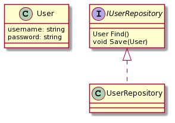

# What is S.O.L.I.D.?
> S.O.L.I.D. is a collection of best-practice, object-oriented design principles which can be applied to your design, allowing you to accomplish various desirable goals such as loose-coupling, higher maintainability, intuitive location of interesting code, etc.

## SRP: Single Responsibility Principle
> "An object should have only one reason to change." In SRP, a reason to change is defined as a responsibility. If an object has more than one reason to change then it has more than one responsibility.

Let's look at this example.

```csharp
public class BankAccount
{
    double Balance { get; }
    void Deposit(double amount) {}
    void Withdraw(double amount) {}
    void AddInterest(double amount) {}
    void Transfer(double amount, IBankAccount toAccount) {}
}
```

If we use this `BankAccount` class for a person's *Checking* and *Saving* account, it would cause this class to have two reasons to change because *Checking* accounts do not have interest added to them but *Saving* accounts do. Now let's make it SRP-friendly.

```csharp
public abstract class BankAccount
{
    double Balance { get; }
    void Deposit(double amount) {}
    void Withdraw(double amount) {}
    void Transfer(double amount, IBankAccount toAccount) {}
}

public class CheckingAccount : BankAccount
{
}

public class SavingAccount : BankAccount
{
    void AddInterest(double amount) {}
}
```

What we have done is making the `BankAccount` class abstract and then make two concrete classes `CheckingAccount` and `SavingAccount` so that we can isolate the methods that were causing the object to have more than one reason to change.

Let's look at another example - `Active Record Pattern`. This pattern violates SRP since a domain entity handles the persistence of its information which is clearly two responsibilities.

```csharp

[ActiveRecord]
public class User : ActiveRecordBase<User>
{
    public User() {}

    public User(string username, string password)
    {
        this.Username = username;
        this.Password = password;
    }

    [PrimaryKey]
    public int Id { get; set; }

    [Property]
    public string Username { get; set; }

    [Property]
    public string Password { get; set; }
}

```

As we can see we define attributes to denote how properties map to columns in database table. To save the `User` we will take an instance of it and call `user.Save()`.



We can get rid of this limitation with this design. So what it boils down to is that the user class knows nothing on how it is persisted to the database.